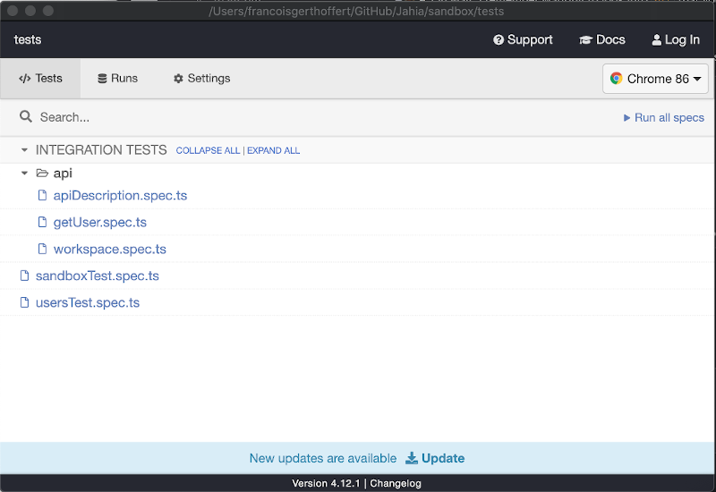

<!--
    Template for Readmes, see alternatives/examples here: https://github.com/matiassingers/awesome-readme
-->

<!--
    Badges provides a quick glance at the state of the repository and pointers to external resources.
    More can be generated from here: https://shields.io/
-->

|           |                                                                                                                                                                                                                                                                                                                                                                                                                                                 |
| --------- | ----------------------------------------------------------------------------------------------------------------------------------------------------------------------------------------------------------------------------------------------------------------------------------------------------------------------------------------------------------------------------------------------------------------------------------------------- |
| Module    |                                                                                                                                                                                                                                                                                                                                   |
| Tests     | [](https://jahia.testrail.net/index.php?/projects/overview/23)                                                                                                                                                                                                                                                                                                  |
| CI / CD   | [](https://app.circleci.com/pipelines/github/Jahia/sandbox)     |
| Artifacts | [](https://devtools.jahia.com/nexus/content/repositories/jahia-snapshots/org/jahia/modules/sandbox/) [](https://devtools.jahia.com/nexus/content/repositories/jahia-releases/org/jahia/modules/sandbox/)                                                                                                                |
| Slack     | [](https://jahia.slack.com/archives/C013904SBRA) [](https://jahia.slack.com/archives/CSMQ0DRHA)                                                                                                                                                              |

<a href="https://www.jahia.com/">
    
</a>
 
<!--
    Project name can either be the full length project name (if there is one) or just the repo name. For example: Digital Experience Manager.
-->
 
# Sandbox

<!--
    A one-liner about the project, like a subtitle. For example: Jahia Digital Experience Manager Core
-->
<p align="center">A sandbox project to try out configuration settings for Jahia repositories</p>

<!--
    A short technical description (not more than one paragraph) about the project, eventually with tech/tools/framework used.
-->
<p align="left">This repository contains a sample Jahia module alongside its CI/CD and testing framework. This can serve as a base for new modules (although you'd probably want to start from a fresh archetype)</p>


<!--
    Open Source badges, see https://shields.io/
-->

## Table of content

- [Presentation](#presentation)
- [Initial module setup for CI/CD](#initial-module-set-up-for-ci-cd)
    - [Setting up the automate module signature](#setting-up-the-automate-module-signature)
    - [Manually updating signature via command line](#manually-updating-signature-via-command-line)
- [Dev Environment](#dev-environment)
- [Build](#build)
- [Installation](#installation)
- [Tests](#tests)
- [Links](#links)

<!--
    Not all sections are relevant for all projects. It's up to the team to decide what sections makes most sense. Objective of the readme is to serve as a technical introduction to faciliate onboarding for technical ppl (developers).
    License and contributions are detailed in their own files, no need to add too many details in the Readme.
    If the project has technical documentation stored in another location (such as a website), effort should be made not to duplicate content (since it will become outdated at some point). In that case, keep the readme instructions very brief (such as a set of CLI commands).
-->

## Presentation

<!--
    (Optional) Technical presentation of the project
-->

## Initial module set-up for CI/CD

The following is a quick checklist of actions to be performed to support CI/CD as the new module is being created.

- Create repository in docker hub
- Create project in Testrail
- Update project-specific details in `.circleci/config` and enable the project in CircleCI admin panel

### Setting up automate module signature

To enable automatically updating the signature of the module for every new release (a.k.a when pom version updates), the following steps 
must be taken:
1. In the `pom.xml`, under `properties` add `<jahia-module-signature></jahia-module-signature>`. If this property is already added and
   populated, ignore this step (It'll get overwritten when the release job runs)
    ```xml
   <properties>
        <jahia-module-signature>[A NEW SIGNATURE WILL BE INSERTED HERE]</jahia-module-signature>
   </properties>
   ```
   <span style="color:red">**Note: Also ensure that there's no plugin that will overwrite this property**</span>
   <br />
   Example: This is a sample snippet where a plugin overwrites the `jahia-module-signature` property
   ```xml
   <!-- The maven-bundle-plugin will use the value from Jahia-Signature to overwrite the jahia-module-signature -->
   <plugin>
     <groupId>org.apache.felix</groupId>
     <artifactId>maven-bundle-plugin</artifactId>
     <extensions>true</extensions>
     <configuration>
       <instructions>
         <Jahia-Depends>default,siteSettings</Jahia-Depends>
         <Import-Package>javax.jcr.query,${jahia.plugin.projectPackageImport},*</Import-Package>
         <Export-Package>{local-packages}</Export-Package>
         <Jahia-Signature>MCwCFGVlwLVMU3HGQXfGIc0bOHTLuiXXAhRENl3WhpI6q950A+aA0p4nGSPA2Q==</Jahia-Signature>      
       </instructions>
     </configuration>
   </plugin>
   ```
   
2. Copy the `upate-signature` job from the [.circleci/config.yml](https://github.com/Jahia/sandbox/blob/main/.circleci/config.yml) folder
   to the module's CircleCI configuration
   
3. Add the `update-signature` job to the `on-release` workflow. See
   [.circleci/config.yml](https://github.com/Jahia/sandbox/blob/main/.circleci/config.yml#L589-L593)
   for reference.
   <br />
   <br />
   With this, the module is now ready to automatically update the signature everytime a new release is push.
   <br/>
   There are times were you need to manually update the version, thus needing to update the signature. 
   To do that you need the following:
      <br />
      <br />
      * An existing circleci token. To create one, follow the instructions
        [here](https://confluence.jahia.com/display/PR/CircleCI+-+Ref+ISPOL08.A14026#CircleCIRefISPOL08.A14026-Howtocreateone)
      * cURL command. See [here](https://curl.se/)
      * The github feature branch
   <br />
   <br />
        
   #### Steps
   1. Manually update the pom.xml file with the desired version, together with the other changes need for this branch
   2. In the commit message, make sure it contains <span style="color:red"><i>**[ci sign]**</i></span>,
      <span style="color:red"><i>**[sign ci]**</i></span>, or <span style="color:red"><i>**[jahia update signature]**</i></span>.
   3. Push changes to remote repository
      
       Example:
      
       ```bash
      git add -A && git commit -Sm "[ci sign] Updated major version from 1.0 to 2.0" && git push 
      # or
      git add -A && git commit -Sm "[sign ci] Updated minor version from 1.0.0 to 1.1.0" && git push 
      # or
      git add -A && git commit -Sm "[jahia update signature] Updated major version from 1.0 to 2.0" && git push 
      ```
      <br/>
   By adding <i>[ci sign], [sign ci], or [jahia update signature]</i> in the git commit, CircleCI will run `update-signature` job which 
   will update the signature
      <br/>
      <br/>
      
   #### Manually triggering the update-signature workflow
   There are times when we need to manually trigger the on-update-signature workflow. To do that, copy and paste the 
   following <i>cURL</i> command with the correct value for the environment variables
   
   ```bash
   export CIRCLECI_PIPELINE_LAUNCH_TOKEN="<type personal token>" ;\
   export CIRCLE_PROJECT_REPONAME="<enter the repository name e.g: sandbox>" ;\
   export CIRCLE_BRANCH="<enter the git branch e.g: main>" ;\
   curl --request POST \
      --url "https://circleci.com/api/v2/project/gh/Jahia/${CIRCLE_PROJECT_REPONAME}/pipeline" \
      --header "circle-token: ${CIRCLECI_PIPELINE_LAUNCH_TOKEN}" \
      --header 'content-type: application/json' \
      --data '{"branch":"'"${CIRCLE_BRANCH}"'","parameters":{"UPDATE_SIGNATURE":true}}'
   ```

## Dev environment

<!--
    Instructions to help a new developer get its environment setup and understands constraints and dependencies and run tests
-->

## Build

<!--
    Instructions to build
-->

## Release

Releases are performed/triggered through the creation of a GitHub release in GitHub (via UI or API).

### Semantic versioning

Jahia uses three digits semantic versioning for its module (for example 2.1.4), please refer to this document to determine which version to use: https://confluence.jahia.com/display/PR/Versioning#Versioning-Modules


### Performing a release

To release a new version of your module, navigate to the repository, then click on:

- Releases
- Draft a new release
- Pick the version to create and the branch to release from, using three digits semantic versioning (1.0.2)
- Select the "This is a pre-release" checkbox
- Click on "Publish release"

If (and only if) "This is a pre-release" checkbox has been selected, the release will be automatically created and staging artifacts will be made available in nexus.

Internally, this trigger a GitHub action, that executes and API call to trigger a CircleCI pipeline which perform the following:

- Delete the (unnecessary) tag created by GitHub, this tag will then be re-created lated on
- Run mvn release:prepare
- Generate the changelog using auto (https://www.npmjs.com/package/auto)
- Run mvn release:perform

Note that the release workflow will then be put on hold, waiting for a manual approval (QA tests OK, etc.). Once the job has been approved, the final release publication job will be triggered (Promoting the Nexus artifacts for now).
If the release is not OK and has to be created again (after a critical fix for instance), as there's no "Disapprove" action on the job, the cancelation will be done with the rollback action (see below).

### Performing rollback on a release

Performing a rollback on a release requires the following assumptions:

* Release has been performed through Circle CI with the rollback workflow added in `.circleci/config.yml`. (Rollback is dependent on caching rollback artifacts during the release phase) and rollback trigger exists in `.github/workflows/triggerRollbackAction.yml`

* Release has been [performed in the last 15 days](https://circleci.com/docs/2.0/caching/#managing-caches). (Rollback is dependent on the rollback artifact cache availability).

* No changes to pom.xml between time of release and rollback. It is expected rollbacks are used only during code freezes. Otherwise, pom.xml will get overwritten with contents at the time of release.

To perform a rollback:

* Go to your repository's releases page `github.com/Jahia/<repo>/releases`
* Click on the latest release and select Delete button on the upper right corner to delete the release

Deleting the release triggers a Github action that triggers the Circle CI workflow with the given Release ID to roll back (from `triggerRollbackAction.yml`). This in turn will perform a `mvn:rollback` against the rollback artifacts that will revert pom.xml changes from maven during time of release. This will also remove the associated tag for the release in the github repository.

Limitations:

* Rollback now removes the staging repository created during release but only if this workflow is triggered while the release publication job i spending for approval (see above)


## Installation

<!--
    Instructions to install
-->

## Tests

This repository contains aa framework to perform both API and UI integration tests, and includes a CircleCI configuration that handles the submission of the tests results to Testrail and slack notification to alert the team of failure on the main branch or during nightly runs.

The codebase of the integration tests is fully separated from the module codebase and sits in the `tests` folder.

### Overview and features

The framework comes pre-configured to support both UI and API tests.

- API tests are located in the `tests/cypress/integration/api/` folder
- UI tests are located in the `tests/cypress/integration/` folder

Tests are written in Typescript and test files should follow this naming conversion: `yourSuite.spec.ts`. If necessary, a test can be disabled by adding the `.example.` suffix, for example: `workspace.spec.example.ts` will not be executed by Cypress (definition of the ignore pattern in `tests/cypress.json`).

To optimize test runtime, stability and overall performance, the challenge is to find the right balance between unit tests, API integration tests and UI integration tests. With all of these running prior to merging the code into any of the shippable branches (`main`, `1_x`, ...).

As a general rule of thumb (from faster to slower):

- Any logic implemented on the front-end based on some API response should be unit-tested, with mock API data
- Features (something happening in the backend) and possible error scenario (incorrect data submitted) should be e2e tested through the API.
- Nominal user flow should be e2e tested through the UI, validating that the module works but without actively trying to "break" it.

In most situations you will end-up with a lot of unit tests, slightly less API e2e, and fewer UI e2e. Note that the purpose of these tests is to validate the proper behavior/operation of the module being developed. It would likely still be necessary to implement various high level integration tests to ensure your module operate well with other in different "real-life" deployment scenarios (but those tests are typically executed after merging of the code).

### Testing with GraphQL

Always try to isolate your graphql queries in separate `.graphql` files stored in `tests/cypress/fixtures/`, and whenever possible, re-use those between your tests.

The apollo client is used for API calls, and is provided by the apolloClient class in `tests/cypress/support/apollo.ts`, this utility class simplify the handling of authorization at an API level:

- **apolloClient()**:uses `JAHIA_USERNAME` and `JAHIA_PASSWORD` provided to Cypress as environment variables
- **apolloClient({})**: for guest (anonymous) queries
- **apolloClient({username: 'john', password: 'doe'})**: for queries with a set username and password
- **apolloClient({token: 'MY-PERSONAL-API-TOKEN'})**: for token based authorization (see module: personal-api-tokens)

Note that if you're doing negative testing (testing that the API fails), you might want to specify the error policy (or, alternatively, use a try/catch), for example:

```typescript
const response = await apolloClient().query({
  query: GQL_DELETE,
  variables: {
    tokenKey: null,
  },
  errorPolicy: "ignore",
});
expect(response.data).to.be.null;
```

Using utility functions to perform common operation can also simplify operations common to all test suites. If this is the case, simply create the corresponding `.ts` file in `tests/cypress/support/`. See [this example](https://github.com/Jahia/personal-api-tokens/blob/main/tests/cypress/support/gql.ts) in the `personal-api-tokens` module.

Those utility functions **are not** replacemenent for your tests, but can greatly simplify code your code. For example if you might have a set of tests validating that a token can be delete, while at the same time, having a utility function to delete a token. This utility function to delete a token would, for example, be called by the test createToken test suite to clean-up after test execution. Again the two are not a replacement for each other but are complementary.

Don't forget to clean-up after your test suite, using statements such as `afterEach` or `afterAll` to remove any of the elements or configuration that might have been created by your individual test or by your suite. See [this example](https://github.com/Jahia/personal-api-tokens/blob/main/tests/cypress/integration/api/createToken.spec.ts) in the `personal-api-tokens` module.

### Develop (and run) a test suite

The recommended approach for writing the tests is to run cypress in debug mode. This will open an Electron instance and let you manually select the suite you're interesting in running.



You can also select the browser to run the test in using the dropdown on the top-right corner.

As you develop your test suite, if you opened it in Cypress, it will automatically run every time you save the `spec.ts` file.

To get started with Cypress:

```bash
# Go to the test folder
cd tests
# Install the needed dependencies
yarn
# Run Cypress, replace CYPRESS_baseUrl the URL of your running Jahia
CYPRESS_baseUrl=http://snapshot.sandbox.jahia.com:8080 JAHIA_USERNAME=root JAHIA_PASSWORD=root yarn e2e:debug
```
If you choose to run cypress locally you may need to specify node version in case you experience high CPU and slow test execution. To do so add `"nodeVersion": "system"` to `cypress.json`.

### Jahia warmup and provisioning

It is not the job of a testing suite to configure the system (for example, install modules, execute groovy scripts) in order to be able to execute the tests, this should be handled ahead of starting test execution.

Soon after the 8.0.2.0 release (currently in 8.0.3.0-SNAPSHOT), a provisioning API was introduced to allow remote provisioning of a Jahia instance.

Note that this replaces `jahia-cli` that was used for some projects in 2020. The major difference (important to keep in mind) is that `jahia-cli` was handling Jahia provisioning from the testing container while the provisioning API send a manifest to Jahia, which then takes care of self-provisioning. The main limitation here is that Jahia cannot access artifacts that are not published in a location it can reach (see below).

To simplify actions when provisioning Jahia a few utility tools were added to [jahia-reporter](https://github.com/Jahia/jahia-reporter). Those are used in the `env.run.sh`.

- `jahia-reporter utils:alive` waits for Jahia to be ready to receive instructions (such as install a module)
- `jahia-reporter utils:provision` takes a provisioning script on the local filesystem and send it to Jahia provisioning API
- `jahia-reporter utils:module` installs a single module, this is necessary when the module was locally built and is not reachable from Jahia

More details about the provisioning API can be found here: https://github.com/Jahia/jahia-private/tree/master/bundles/provisioning

**Important note**: NEXUS_USERNAME and NEXUS_PASSWORD are automatically replaced by the corresponding environment variables (defined at runtime or in the .env file) when the Docker image is running, don't put nexus credentials in the yml file. This would work but is not safe since this file is aimed at being checked in the remote (and potentially public) codebase.

Jahia warmup is executed in the Docker test image just before executing the tests themselves (see `tests/env.run.sh`).

### Run the entire test suite

There are multiple ways of running the entire test suite (pick one):

- Manually in node
- Automatically with docker and default settings
- Building the test docker image
- Automatically in CI/CD

#### Manually in node

Running the full test suite manually is very similar to running it in debug mode, except that it will run headless without any user interaction.

```bash
# Go to the test folder
cd tests
# Install the needed dependencies
yarn
# Run Cypress, replace CYPRESS_baseUrl the URL of your running Jahia
CYPRESS_baseUrl=http://snapshot.sandbox.jahia.com:8080 JAHIA_USERNAME=root JAHIA_PASSWORD=root yarn e2e:ci
```

#### Building and run the tests in Docker

Before running the tests in the CI/CD platform and since code has been modified, the test Docker image are re-created to integrate any new modification. If you want to run the exact same setup on your machine that what will be running remotely, the test Docker image can be built locally.

```bash
cd tests
# Set-up the default environment variables
mv .env.example .env
# This builds the image, creating an image called: jahia/sandbox:latest
# You can modify this name (as well as the TESTS_IMAGE environment variable in your .env file)
# This doesn't push the image, it is only built locally and only available to you
bash env.build.sh
# This is usually only needed once.
docker login
# Run the tests
docker-compose up
```

Note that you might want to modify the `env.build.sh`, depending of your use case, for example to integrate more artifacts in the Docker image. There might be some subtilities when dealing with artifacts and jahia provisioning, so don't hesitate to reach-out if you have any questions.

The above command runs docker-compose in 'attached' mode, which will output all logs (with different color coding) for both jahia and cypress. You can monitor test execution (or access jahia logs) using docker logs (for example with: `docker logs -f cypress` in another terminal just after `docker-compose`). Adding `-d` to `docker-compose` runs it in detached mode, does not display logs, and keeps it running if you close your terminal.

#### Automatically in CI/CD

The automated run is configured in the `integration-tests` job in the `.circleci/config.yml` file at the root of the repository.

This configuration includes run of the test (and automated build of the image) whenever new code is being pushed to the remote repository. It also includes nightly runs, that run using the latest built test image (created by a code merge).

#### Manually in CI/CD

You can trigger a run of the tests in CircleCI by doing an API call (updating `REPLACE_ME` with your token). This will trigger the `manual-run` workflow with the provided parameters.

You can change the `branch` to trigger a run on any of the current branches.

By providing a manifest URL (on a publicly-reachable URL), you're able to download that manifest and use it to provision Jahia, you can also refer to a manifest bundled within the Docker image `TESTS_IMAGE_NAMETAG`. You can also rebuild the docker image from the branch' codebase by providing the `SHOULD_BUILD_TEST_IMAGE` parameter.

This technique is particularly useful if you want to run the tests against an artifact in nexus staging (which would be referenced in the manifest)

```bash
curl --request POST \
  --url https://circleci.com/api/v2/project/github/Jahia/sandbox/pipeline \
  --header 'Content-Type: application/json' \
  --header 'authorization: Basic REPLACE_ME' \
  --data '{
	"branch":"main", 
	"parameters": { 
		"JAHIA_IMAGE": "jahia/jahia-ee-dev:8-SNAPSHOT",		
		"TESTS_MANIFEST": "provisioning-manifest-snapshot.yml",
		"MODULE_ID": "sandbox",
		"TESTRAIL_PROJECTNAME": "Sandbox Module",
		"TESTRAIL_MILESTONE": "Test-Manual"
	}
}
'
```

Please refer to [.circleci/config.yml](.circleci/config.yml) for the list of supported parameters.

### Questions

For Circleci questions, don't hesitate to reach out on Slack, in the `#circleci-config` channel. For Cypress and general testing questions, you can reach out in the `#product-qa` channel.

## Links

<!--
    Relevant links
-->
